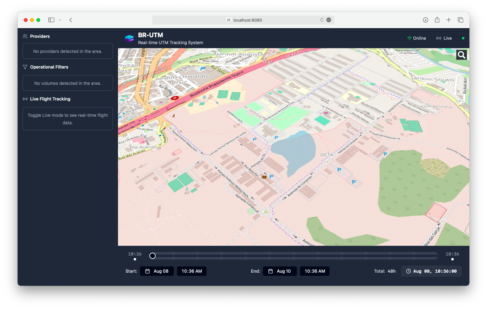

# BR-UTM Observer

Para executar localmente. 

Recomendações (não usados no projeto original):
* [Astral UV](https://github.com/astral-sh/uv) - gerenciamento de configuração e versões do Python (cada projeto com seu Python!)
* [VSCodium](https://github.com/VSCodium/vscodium) - IDE (quase identica ao MS-VSCode)
* [NVM](https://github.com/nvm-sh/nvm) - gerenciador de versão do NodeJS (gerencia versões diferentes, de acordo com o projeto)

## Local

Instalar UV:

```sh
curl -LsSf https://astral.sh/uv/install.sh | sh
```

Instalar Python e criar ambiente virtual:

```sh
uv venv --python 3.12
source .venv/bin/activate
```

Instalar dependências:

```sh
uv sync --group test
```


### Root (**utm-observer**)

Configurar projeto **root** (arquivo `pyproject.toml`). Configurei **PyTest** para rodar alguma integração futura:

```toml
[project]
name = "utm-observer"
version = "0.1.0"
description = ""
readme = "README.md"
requires-python = ">=3.12"
license = "Apache-2.0"
dependencies = [
    "backend",
]

[tool.uv.workspace]
members = [
    "backend",
]

[tool.uv.sources]
backend = { workspace = true }

[dependency-groups]
test = [
    "bcrypt>=4.2.0",
    "httpx>=0.27.2",
    "pyjwt[crypto]>=2.9.0",
    "pytest-asyncio>=0.25.0",
    "pytest-cov",
    "pytest-sugar",
    "pytest-testmon",
    "pytest>=6.0",
]

[tool.pytest.ini_options]
minversion = "6.0"
addopts = "-ra -q -s"
testpaths = [
    "tests",
]
asyncio_default_fixture_loop_scope = "function"
```

#### Root Launch **Backend** & **Interface**

Configurar VSCodium (arquivo `.vscode/launch.json`). Tem duas configurações:

* Backend - projeto em **Python** que roda na retaguarda
* Interface - projeto **NodeJS/TypeScript/React** que serve de painel de controle 

```json
{
    "version": "0.2.0",
    "configurations": [
        {
            "name": "Interface",
            "request": "launch",
            "runtimeArgs": [
                "run",
                "dev"
            ],
            "runtimeExecutable": "npm",
            "runtimeVersion": "22.18.0",
            "skipFiles": [
                "<node_internals>/**"
            ],
            "type": "node",
            "cwd": "${workspaceFolder}/interface",
            "console": "integratedTerminal"
        },
        {
            "name": "Backend",
            "type": "python",
            "request": "launch",
            "module": "uvicorn.main",
            "args": [
                "app:app",
                "--host", "0.0.0.0",
                "--port", "8000",
                "--reload"
            ],
            "cwd": "${workspaceFolder}/backend",
            "console": "integratedTerminal",
            "env": {
                "PYTHONPATH": "${workspaceFolder}",
                "PYTHONPYCACHEPREFIX": "/tmp",
                "VIRTUAL_ENV": "${workspaceFolder}/.venv",
                "PATH": "${workspaceFolder}/.venv/bin:${env:PATH}"
            },
            "python": "${workspaceFolder}/.venv/bin/python",
            "justMyCode": false,
        },
    ]
}
```

### Backend

Configurar projeto (arquivo `pyproject.toml`):

```toml
[project]
name = "backend"
version = "0.1.0"
description = ""
readme = "NOTES.md"
requires-python = ">=3.12"
license = "Apache-2.0"
dependencies = [
    "fastapi[standard]==0.115.12",
    "starlette==0.46.2",
    "uvicorn==0.35.0",
    "motor==3.7.1",
    "pydantic==2.11.4",
    "pydantic-core==2.33.2",
    "pydantic-settings==2.9.1",
    "pyjwt==2.10.1",
    "jmespath==1.0.1",
    "cryptography==45.0.2",
    "loguru==0.7.3",
    "pytest==8.3.5",
    "vnoise==0.1.0",
]

[dependency-groups]
test = [
    "bcrypt>=4.2.0",
    "httpx>=0.27.2",
    "pyjwt[crypto]>=2.9.0",
    "pytest-asyncio>=0.25.0",
    "pytest-cov",
    "pytest-sugar",
    "pytest-testmon",
    "pytest>=6.0",
]

[tool.setuptools]
py-modules = []

[tool.pytest.ini_options]
minversion = "6.0"
addopts = "-ra -q -s"
testpaths = [
    "tests",
]
asyncio_default_fixture_loop_scope = "function"
```

### Interface

#### NodeJS

Instalar **NVM**:

```bash
curl -o- https://raw.githubusercontent.com/nvm-sh/nvm/v0.40.3/install.sh | bash
```

> Fechar e reabrir o VSCode!

Instalar **NodeJS**:

```bash
nvm install --lts
npm i
```

#### Arquivo **.nvmrc**

A versão **LTS** do **NodeJS**

```
22.18.0
```

#### Executar

Se quiser rodar na linha de comando, mas pode usar o *Launch* do **VSCodium** para depurar se quiser

```bash
npm run dev
```

Usuário e senha em [interface/.env](./interface/.env)




## Server

Para o caso de alguém querer rodar como um container **Docker** num servidor remoto!

Arquivo `docker-compose.local.yml`. Diferenças para o do projeto original:

* Nome dos containers
* Porta dinâmica
* Rede local **Docker**
* Removi o provedor de *logs* **Fluent** (não quero ter que instalar)

```yaml
version: "3"

services:
  backend:
    container_name: utmbck
    build: ./backend
    ports:
      - ":8000"
    networks:
      lab01:
        ipv4_address: 172.16.200.1
    environment:
      - ENV=dev
  interface:
    container_name: utmifc
    build: ./interface
    ports:
      - ":80"
    networks:
      lab01:
        ipv4_address: 172.16.200.2
    environment:
      - ENV=dev

networks:
  lab01:
    external: true
```

Criar a rede para o **Docker**:


```sh
docker network create --driver bridge lab01 --subnet='172.16.0.0/16'
```

Criar os containers:

```sh
docker compose -f docker-compose.local.yml up --build --detach
```

Achar eles na rede:

```sh
docker ps -q | xargs -n1 docker inspect --format '{{.Name}} - {{range .NetworkSettings.Networks}}{{.IPAddress}}{{end}}'
```

Usei uma porta diferente para não dar conflito com o servidor:

```sh
ssh -p 2222 -fN -L 8000:172.16.200.1:8000 xxxx@m.n.o.p
ssh -p 2222 -fN -L 8001:172.16.200.2:80 xxxx@m.n.o.p
```

Abrir o *browser* (a mesma coisa de acessar localmente):

http://http://localhost:8001


## **.gitignore**

Para não adicionar meus arquivos ao projeto original (não quero fazer fork por enquanto). Os arquivos `run-backend.sh` e `interface-ec` são do `.gitignore` original, e os demais são meus:

```
run-backend.sh
interface-ec
NOTES.md
NOTES.pdf
BR-UTM.png
docker-compose.local.yml
pyproject.toml
uv.lock
.nvmrc
/.vscode
*.egg-info
```
